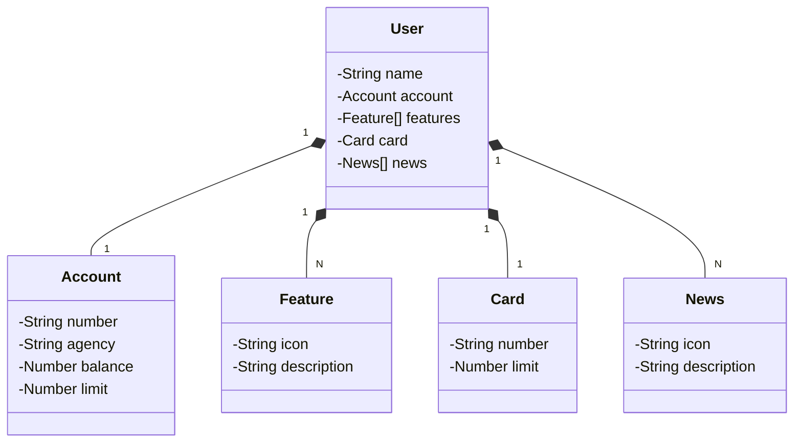

# Santander Dev Week Java API

RESTful API da Santander Dev Week 2023 construída em Java 17 com Spring Boot 3.

## Principais Tecnologias
 - **Java 17**: Utilizaremos a versão LTS mais recente do Java para tirar vantagem das últimas inovações que essa linguagem robusta e amplamente utilizada oferece;
 - **Spring Boot 3**: Trabalharemos com a mais nova versão do Spring Boot, que maximiza a produtividade do desenvolvedor por meio de sua poderosa premissa de autoconfiguração;
 - **Spring Data JPA**: Exploraremos como essa ferramenta pode simplificar nossa camada de acesso aos dados, facilitando a integração com bancos de dados SQL;
 - **OpenAPI (Swagger)**: Vamos criar uma documentação de API eficaz e fácil de entender usando a OpenAPI (Swagger), perfeitamente alinhada com a alta produtividade que o Spring Boot oferece;
 - **Railway**: facilita o deploy e monitoramento de nossas soluções na nuvem, além de oferecer diversos bancos de dados como serviço e pipelines de CI/CD.

## [Link do Figma](https://www.figma.com/file/0ZsjwjsYlYd3timxqMWlbj/SANTANDER---Projeto-Web%2FMobile?type=design&node-id=1421%3A432&mode=design&t=6dPQuerScEQH0zAn-1)

O Figma foi utilizado para a abstração do domínio desta API, sendo útil na análise e projeto da solução.

## Diagrama de Classes (Domínio da API)

## Documentação da API (Swagger)

### https://sdw-2025-api-prod.up.railway.app/swagger-ui/index.html

## 💡 Observações sobre o desenvolvimento

Durante o desenvolvimento deste projeto, é possível notar um número elevado de *commits* com nomes semelhantes.  
Isso ocorreu porque, até então, eu nunca havia trabalhado com o **Railway**, o que trouxe alguns desafios em sua configuração.

Em determinados momentos, a aplicação apresentava **erros relacionados ao protocolo HTTP** ao tentar realizar requisições.  
Em outros, surgiam falhas nas **rotas de configuração do `Application`**, classe responsável por inicializar a aplicação.

---

## 🧭 Conclusão

Como resultado deste projeto, pude **aprimorar significativamente meus conhecimentos** tanto na **criação de APIs** quanto em um aspecto novo para mim: o **deploy e execução da aplicação em ambiente remoto**, diferente do ambiente local de desenvolvimento.

